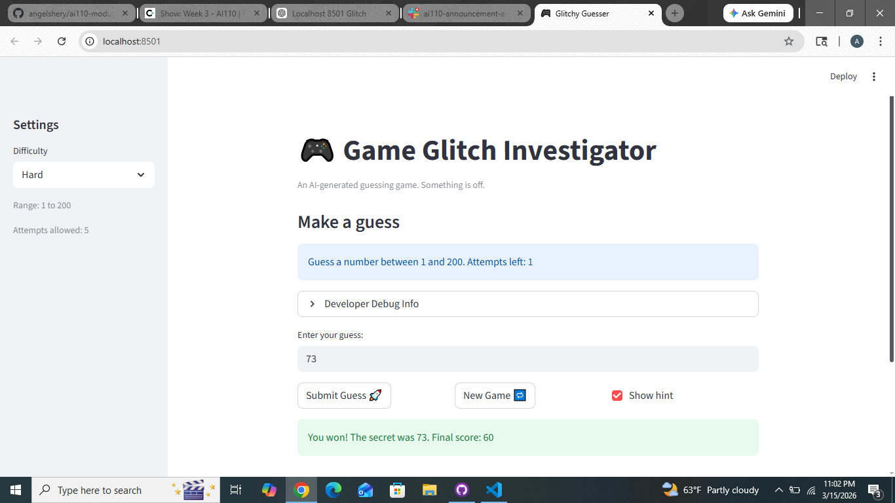

# 🎮 Game Glitch Investigator: The Impossible Guesser

## 🚨 The Situation

You asked an AI to build a simple "Number Guessing Game" using Streamlit.
It wrote the code, ran away, and now the game is unplayable. 

- You can't win.
- The hints lie to you.
- The secret number seems to have commitment issues.

## 🛠️ Setup

1. Install dependencies: `pip install -r requirements.txt`
2. Run the broken app: `python -m streamlit run app.py`

## 🕵️‍♂️ Your Mission

1. **Play the game.** Open the "Developer Debug Info" tab in the app to see the secret number. Try to win.
2. **Find the State Bug.** Why does the secret number change every time you click "Submit"? Ask ChatGPT: *"How do I keep a variable from resetting in Streamlit when I click a button?"*
3. **Fix the Logic.** The hints ("Higher/Lower") are wrong. Fix them.
4. **Refactor & Test.** - Move the logic into `logic_utils.py`.
   - Run `pytest` in your terminal.
   - Keep fixing until all tests pass!

## 📝 Document Your Experience

- [x] Describe the game's purpose.
The purpose of this game is to let the player guess a secret number within a limited number of attempts.
The player receives hints after each guess indicating whether the guess is too high or too low.
The goal is to correctly guess the secret number before running out of attempts.

- [x] Detail which bugs you found.
Hint logic was incorrect
When the guess was higher than the secret number, the game sometimes displayed hints that suggested guessing higher instead of lower.

Secret number type bug
The secret number was sometimes converted into a string during gameplay, which caused incorrect comparisons between the guess and the secret number.

Difficulty range inconsistency
The range for Hard difficulty was smaller than the range for Normal difficulty, which made Hard mode easier than expected.

- [x] Explain what fixes you applied.
Corrected the hint logic so that:

"Too High" → hint shows Go LOWER

"Too Low" → hint shows Go HIGHER

Removed the code that converted the secret number into a string, ensuring comparisons always use integers.

Refactored the game logic functions into logic_utils.py:

get_range_for_difficulty()

parse_guess()

check_guess()

update_score()

Updated app.py to import and use these functions properly.

Ran pytest to verify that the core game logic functions behaved correctly.

## 📸 Demo

- [x] [Insert a screenshot of your fixed, winning game here]

## 🚀 Stretch Features

- [ ] [If you choose to complete Challenge 4, insert a screenshot of your Enhanced Game UI here]
